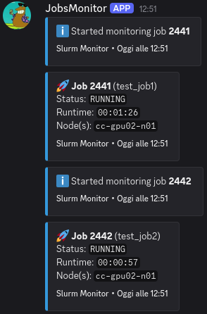
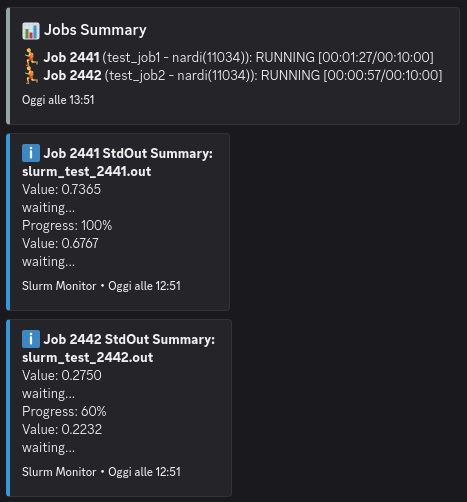
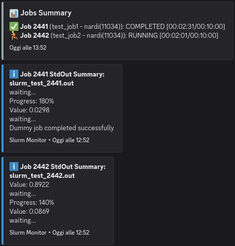
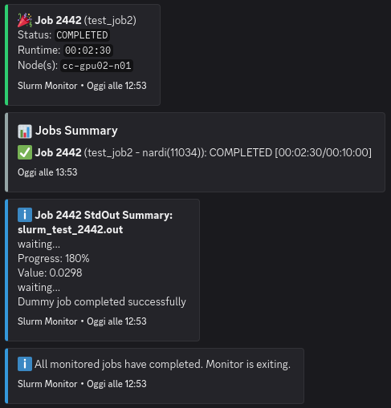

# Slurm Discord Monitor

Multi-job Slurm monitoring with real-time Discord notifications.

## Installation

Requirements: [uv](https://uv.run) (version >= 1.4.0)

```bash
# Clone the repo
git clone slurm-jobs-monitor
cd slurm-jobs-monitor

# Install with uv and just test the hello world monitor
uv run hello-monitor
```


## Quick Start

This program just needs to be in an entry node of the Slurm-manged cluster.

```bash
# Monitor a single job that checks every 30 seconds
uv run slurmonitor 12345 --check-interval 30

# Add periodic updates every 1800 seconds
uv run slurmonitor 12345 --periodic-updates --update-interval 1800

# Monitor multiple jobs
uv run slurmonitor 12345 12346 12347
```


## Setup instructions

### Create a Discord webhook

1. Create a private Discord server
2. Server Settings -> Integrations -> Webhooks and click "New Webhook"
3. Create a config file as follows (which includes the webhook) will be ignored by git

```yaml
discord:
  webhook_file: https://discord.com/api/webhooks/...

jobs:
  - 12345
  - 12346

job_status:
  check_interval: 10
  exit_when_done: true

periodic_updates:
  enabled: true
  update_interval: 30
```

Check the full list of options in `assets/config.yaml`.

### Run in a persistent session

Once you have launched jobs, you can use `tmux` to run the monitor in a persistent session:
```bash
tmux new -s slurmonitor
uv run slurmonitor 12345
# Detach with Ctrl+b d (then you can exit the shell safely)

# Check the session
tmux list-sessions  #  you should see slurmonitor running

# To re-attach later:
tmux attach -t slurmonitor

# Close the session when done:
tmux kill-session -t slurmonitor
```

### Run a test

Run a simple test (you should see Discord notifications and the job running in the cluster):
```bash
# Run the test
uv run tests/test_slurm_monitor.py
```

Run one more test:
```bash
# Activate dummy script
chmod +x tests/dummy.sh

# Launch two jobs
sbatch --job-name=test_job1 tests/dummy.sh
sbatch --job-name=test_job2 tests/dummy.sh

# Monitor the jobs (replace JOB_ID with the actual job ID)
uv run slurmonitor JOB_ID1 JOB_ID2 --check-interval 10 --periodic-updates --update-interval 20
```

<table>
    <tr>
        <td></td>
        <td></td>
        <td></td>
        <td></td>
    </tr>
</table>


## Features

- Multi-threaded real-time monitoring of multiple Slurm jobs (launched via `sbatch`)
- Discord notifications for job status changes
- Log file summarization using AI
- Periodic updates on job progress
- Easy setup with Discord webhooks


<!-- ## Enhancements

- [ ] Use rich tables for better CLI readability
- [ ] From webhook on .txt to a .yaml config file with other options (e.g., default check interval)
- [ ] Extract other infos from the job (job-name, user, etc.) and include them in the notifications
- [ ] Basic log (StdOut) summarization/detection of anomalies
- [ ] Integrate LogSummarizerAgent for better log summarization -->
